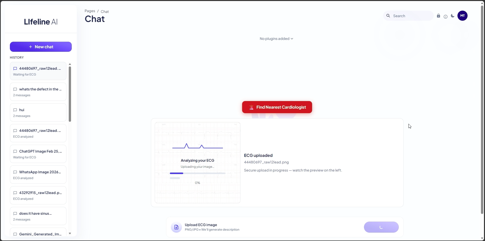
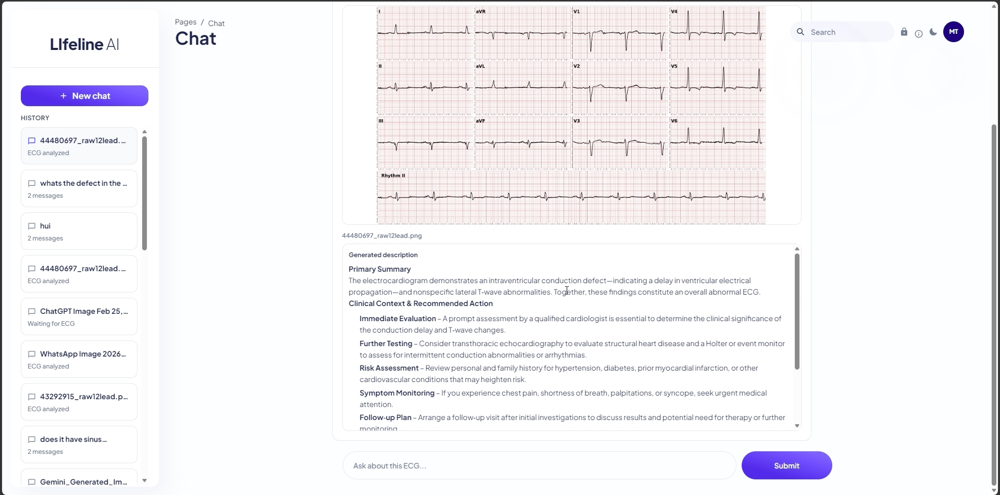
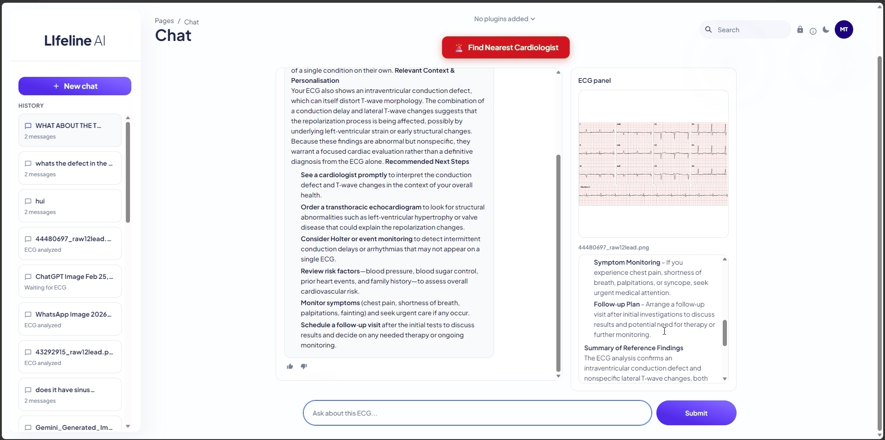
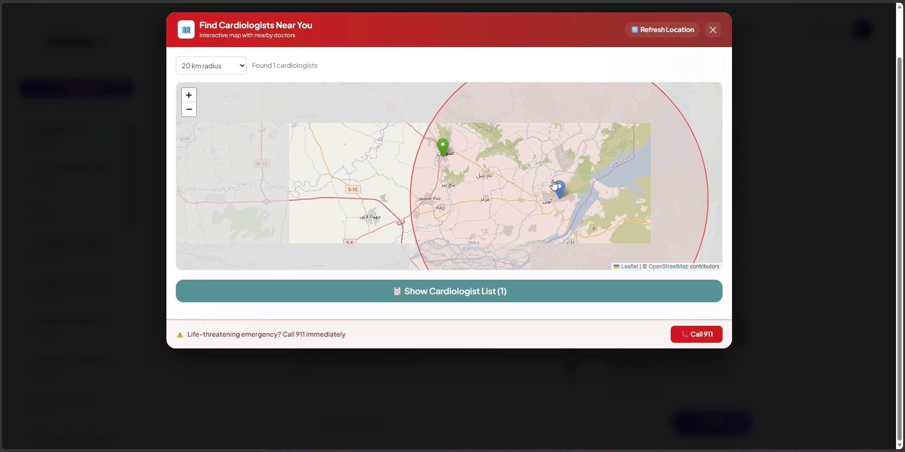
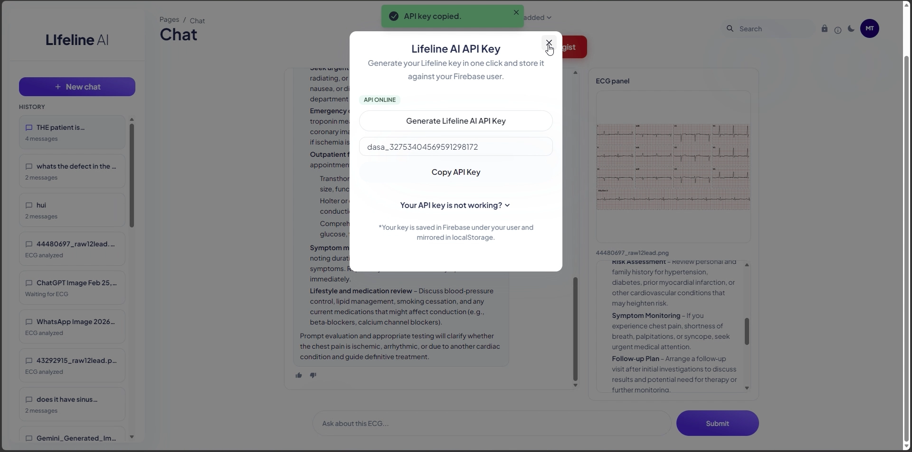
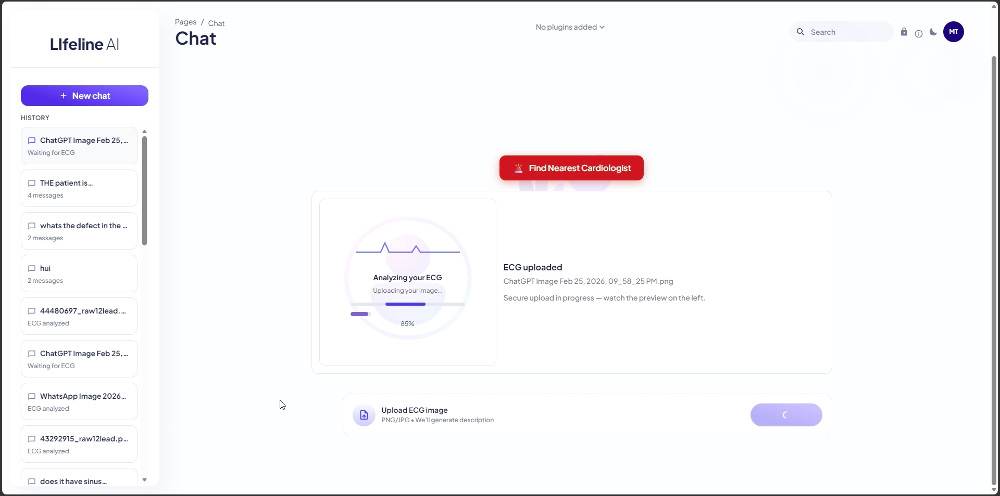
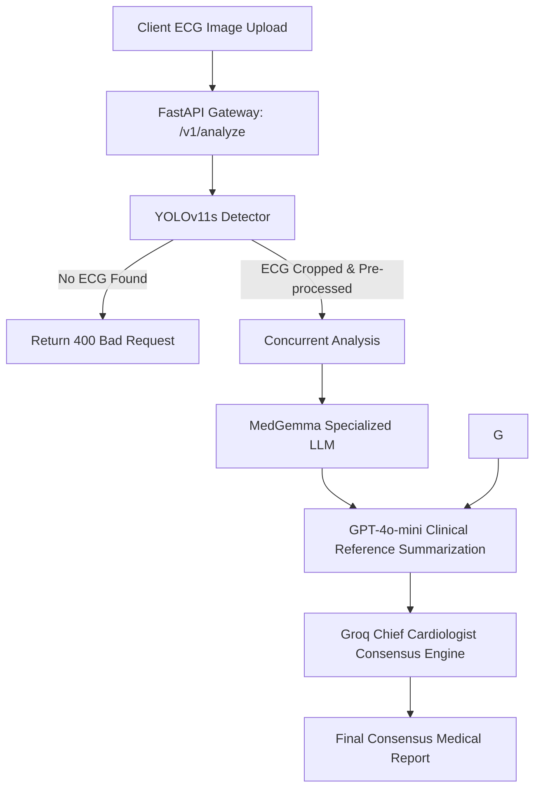
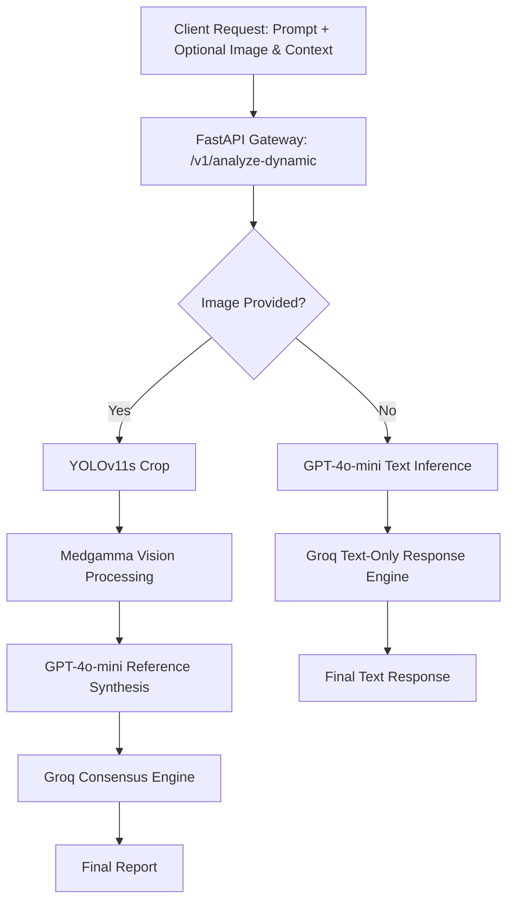

Welcome to **LifeLine.ai**, a next-generation clinical decision-support system and API gateway designed for automated ECG localization, parallel model diagnostics, and patient resource navigation. This project represents our Final Year Project (FYP) and is engineered to serve as a robust backend framework for AI-assisted cardiology.

---

## 🚀 Key Features

*   **Hierarchical AI Diagnostics Pipeline**: Combines state-of-the-art vision models (YOLOv11s), multi-modal LLMs (PULSE-7B), specialized clinical models (MedGemma), and consensus synthesizers (GPT-4o-mini, Groq).
*   **Automated ECG Localization**: Pre-processes raw scans (correcting alpha channels for PNGs and applying pad-expansion padding) to crop precise ECG segments using YOLOv11s.
*   **Dual-VLM Consensus Engine**: Concurrently queries PULSE-7B (hosted on serverless Modal GPU) and MedGemma (hosted behind ngrok tunnels) for parallel diagnostics.
*   **Dynamic Multimodal Chat & Q&A**: Supports custom prompts with or without accompanying ECG images, automatically adjusting processing pipelines based on the inputs.
*   **API Key Management Dashboard**: SQLite-backed developer key provisioning (`dasa_` key strings) mapped against user emails with strict registry limit enforcement (max 2 keys).
*   **Emergency Resource Finder**: Integrated locator dashboards to direct anomalous cases to the nearest cardiologists or emergency care.

---

## 📸 Screenshots Showcase

Here is a visual walk-through of the LifeLine.ai application:

| **1. Analyzing Uploaded ECG** | **2. ECG Results & Visualization** |
| :---: | :---: |
|  <br> *Web Chat interface waiting for analysis* |  <br> *ECG visualization and analysis* |

| **3. Context & Personalization** | **4. Nearest Cardiologist Locator** |
| :---: | :---: |
|  <br> *Adding patient history or clinical context* |  <br> *Interactive map pointing to nearby doctors* |

| **5. API Key Generation Panel** | **6. Conversational History** |
| :---: | :---: |
|  <br> *Generate and copy developer API keys* |  <br> *Visualizing patient chat logs* |

---

## 🛠️ Architecture & Pipeline Flow

The backend system is designed to route patient data through a series of specialized models, acting as a virtual **Chief Medical Officer** weighing diagnostic reports.

### 1. Core Diagnostic Pipeline (`POST /v1/analyze`)
This diagram shows the sequential process from uploading a raw ECG scan to obtaining the Chief Cardiologist's final consensus report.



### 2. Dynamic Multimodal Q&A (`POST /v1/analyze-dynamic`)
For custom queries, the endpoint automatically shifts between text-only and visual paths.



---

## 📂 Repository Structure

*   [main.py](file:///Volumes/ssd2/Custom%20Library/main.py): The main FastAPI gateway exposing key registration and medical diagnostic endpoints.
*   [YOLO_Detector.py](file:///Volumes/ssd2/Custom%20Library/YOLO_Detector.py): Pre-processes raw images, adds boundary padding, and crops the core ECG area using YOLOv11s (`Yolo Weights/best.pt`).
*   [LLAVA_FineTuned.py](file:///Volumes/ssd2/Custom%20Library/LLAVA_FineTuned.py) / [LLAVA_Prompt.py](file:///Volumes/ssd2/Custom%20Library/LLAVA_Prompt.py): Client connectors to query the fine-tuned PULSE-7B VLM.
*   [MedGamma_FineTuned.py](file:///Volumes/ssd2/Custom%20Library/MedGamma_FineTuned.py): Asynchronous client connector for the MedGemma model.
*   [GPTNano_Context.py](file:///Volumes/ssd2/Custom%20Library/GPTNano_Context.py) / [GPTNano_Prompt.py](file:///Volumes/ssd2/Custom%20Library/GPTNano_Prompt.py): Connects to the Azure Inference Client to synthesize clinical findings into structured reports under weighted rules.
*   [Groq_Summary.py](file:///Volumes/ssd2/Custom%20Library/Groq_Summary.py) / [GROQ_Prompt.py](file:///Volumes/ssd2/Custom%20Library/GROQ_Prompt.py): Implements the Chief Cardiologist consensus agent utilizing Llama-based LLMs hosted on Groq.
*   [MODALAPI/app.py](file:///Volumes/ssd2/Custom%20Library/MODALAPI/app.py): Lightweight proxy script running on the local GPU machine/Mac Mini to route requests to the serverless Modal GPU runner.
*   [SDK.md](file:///Volumes/ssd2/Custom%20Library/SDK.md): Official SDK installation instructions and detailed code examples for developers using `lifeline-sdk`.
*   [test_pipeline.py](file:///Volumes/ssd2/Custom%20Library/test_pipeline.py): Extensive testing suite containing 34 unit tests mocking all AI pipelines.

---

## 🔌 API Documentation & Endpoints

### Key Management

#### 🔑 Generate API Key
Generates a unique credential starting with `dasa_`. Requires an admin master secret in headers. Maximum of 2 active keys per email.
*   **Endpoint**: `POST /v1/keys/generate`
*   **Headers**: `admin-secret: <HF_ADMIN_SECRET>`
*   **Body (JSON)**:
    ```json
    {
      "email": "doctor@hospital.com"
    }
    ```

#### 🗑️ Delete Oldest API Key
Deletes the oldest key associated with an email to free up space.
*   **Endpoint**: `DELETE /v1/keys/delete-oldest`
*   **Headers**: `admin-secret: <HF_ADMIN_SECRET>`
*   **Body (JSON)**:
    ```json
    {
      "email": "doctor@hospital.com"
    }
    ```

### Diagnostics

#### 🩺 Analyze ECG Image (Static Pipeline)
The main image diagnostic pipeline. Runs YOLO crop, concurrency checks on PULSE & MedGemma, clinical reference summarization, and final master report.
*   **Endpoint**: `POST /v1/analyze`
*   **Headers**: `x-api-key: <your_developer_key>`
*   **Body (Multipart Form-Data)**:
    *   `file`: (ECG Image File - PNG/JPEG)

#### 💬 Analyze ECG Dynamic (Multimodal / Text Q&A Pipeline)
Interactive endpoint supporting prompt text, patient context history, and optional image upload.
*   **Endpoint**: `POST /v1/analyze-dynamic`
*   **Headers**: `x-api-key: <your_developer_key>`
*   **Body (Multipart Form-Data)**:
    *   `prompt`: "Is there any sign of Ventricular Tachycardia?" (Required)
    *   `context`: "Patient age 65, presents with chest pain." (Optional)
    *   `file`: (ECG Image File - Optional)

---

## ⚙️ Installation & Setup

### 1. Clone the repository
```bash
git clone https://github.com/Asad939asad/LifeLine.ai-.git
cd LifeLine.ai-
```

### 2. Configure Environment Variables
Create a `.env` file in the root directory:
```ini
HF_ADMIN_SECRET="your_admin_master_secret"
GITHUB_TOKEN="your_github_models_token"
GROQ_API_KEY="your_groq_api_key"
```

### 3. Deploy locally with Docker
Build and run the FastAPI server inside a container:
```bash
docker build -t lifeline-api .
docker run -d -p 7860:7860 --env-file .env lifeline-api
```
The server will boot up and be accessible at `http://localhost:7860`.

### 4. Running the Local Bridge
If you need to connect to the PULSE-7B model deployed on Modal:
```bash
cd MODALAPI
python -m venv venv
source venv/bin/activate
pip install -r ../requirements.txt
python app.py
```
This runs the lightweight proxy bridge on `http://localhost:8004` (which you can expose via `ngrok http 8004`).

---

## 🧪 Running Unit Tests

The project includes a comprehensive mock test suite that ensures all routing, authorization, and model fallback behaviors operate correctly without making network requests.

Run the unit tests via `pytest`:
```bash
pytest test_pipeline.py -v
```
All 34 tests should pass:
```text
======================= 34 passed, 4 warnings in 4.46s ========================
```
# LifeLine.ai-
# LifeLine.ai-
